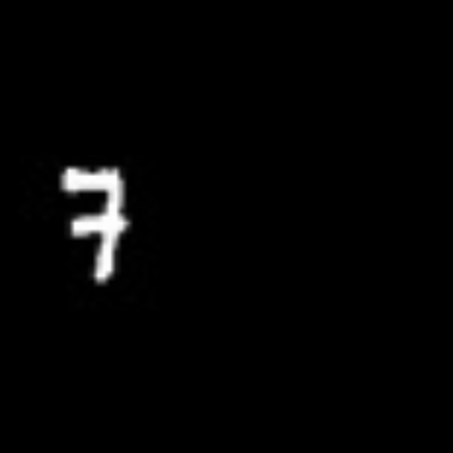
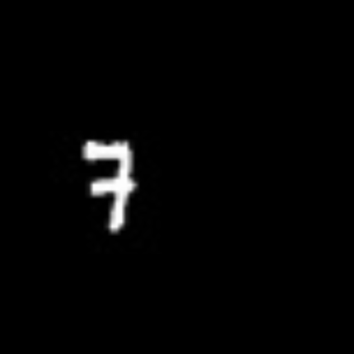
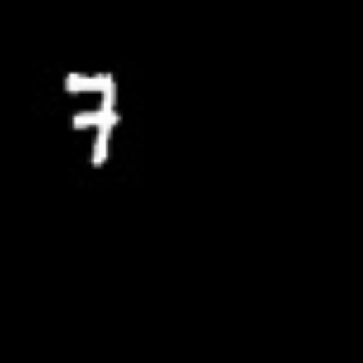
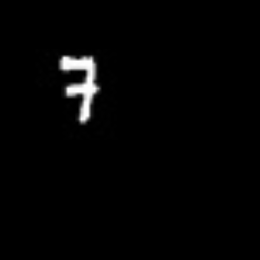
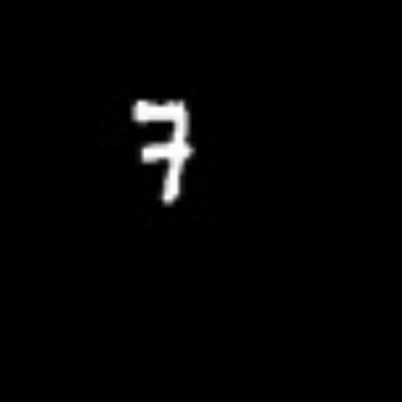

# motionVectorsVideoFrames
predicting future frames using motion vectors
Given : Two Greyscale Frames at T - 33.36ms and at T times respectively.
Find contours in the frames using cv2.findContours function and draw out the bounding box image.
Calculate the middle of the bounding boxes of respective contours in both the frames.
Calculate the motion vector i.e, the angle and magnitude of the contours between these two frames.
Map this vector to a linear function.
Extrapolate this function to meet the new position of the middle of the contour based on time (in this case after 1ms, 33.36ms and 1s). 
	If new position out of range then bounce it back into the frame. (input 2 below at T+1s)
Using this new middle position of the contour draw the saved contour around it.

Input : 

T-33.36ms

T

Output : 

T+1ms

T+33.36ms

T+1000ms

